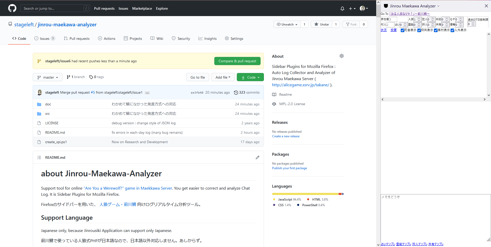

# about Jinrou-Maekawa-Analyzer

Support tool for online "Are You a Werewolf?" game in Maekkawa Server ( http://alicegame.xsrv.jp/takane/ ).
You get easier to correct and analyze Chat Log.
It is Sidebar Plugins for Mozilla Firefox.

Firefoxのサイドバーを用いた、人狼ゲーム・前川鯖 http://alicegame.xsrv.jp/takane/ 向けログリアルタイム分析ツール。

## Support Language

Japanese only, because Jinrousiki Application can support only Japanese.

前川鯖で使っている人狼式PHPが日本語なので、日本語以外対応しません。あしからず。

## How to Install （どうやってインストールするの？）

### Install （普通にインストールする場合）

https://addons.mozilla.org/ja/firefox/addon/jinrou-maekawa-analyzer/ からインストールしてください。

### Update （インストールしたものを最新化する場合）

1. アドオンマネージャー（ about:addons ）にアクセスし、インストールされている Jinrou Wakamete Analyzer のバージョンを確認してください。  
   右上のメニュー（横線３本アイコン）→アドオン、あるいは、Ctrl+Shift+Aでもアクセスできます。
1. アドオンマネージャー、先程バージョンを確認した画面にて、設定アイコン（右上の歯車）から「今すぐ更新を確認」をクリックします。
1. 同じ画面にて、インストールされている Jinrou Wakamete Analyzer のバージョンが最新と一致していれば完了です。

## How to Use （どうやって使うの？）

### 基本的な使い方・村参加時の推理サポート

スクリーンショットは、 村（１５３５３５番【モバマス】年の瀬村 http://jinrou.aa0.netvolante.jp/~jinrou/kako/153535.html ）の状況である（デバッグモードにて作成）。

1. サイドバーを表示する（下図）。  
   サイドバー上部の「Go To 「汝は人狼なりや？」続わかめてエディション」をクリックすることで、同サイトのフレームなし版にアクセスする。
   

1. 村民登録を行い、ゲームの開始を待つ。  
     
   このとき、ツールの仕様の都合上、以下の注意点がある。  
    1. 複数のウィンドウを開いてはいけない。
    1. 複数の画面で村および過去ログを見てはいけない。

1. 村が始まったところで、サイドバーの上部に配役を入力する。  
   配役が入力されると、CO状況のまとめ表がサイドバー中央下部に表示される（詳細は、サイドバー中央下部の状況表示領域説明にて後述する）。  
     
    1. 配役横の「過去ログ日数制限」は0であることを確認しておくこと。
    1. 配役未入力の場合は、[配役一覧](http://alicegame.xsrv.jp/takane/info/cast.php)に記載の配役が入力されている。ご自身の村の配役に合わせ、適宜訂正すること。  

1. サイドバー中央上部の推理表に、村の進行状況に合わせて必要な情報を適宜入力していく。
    1. 「１日目」の列、各参加者のプルダウンメニューを選択し、CO状況、人外の推理状況、を選択入力する。  
       また、合わせて、各日の占い結果・霊能結果もプルダウンメニューにて同様に選択入力する。  
         
         
       推理表の詳細な仕様は以下のとおり。
        1. 日数は１日目を除き、逆順で表示される。名前と近い側に、入力すべき最新情報があると認識すること。  
        1. 各々の日付では、占い結果・霊能結果の入力メニュー以外に、当日の発言数が表示されている。  
           死亡・復活当日においては、その理由を表示する。  
           ただし、最終日において仕様上の不具合あり、適切な表示が得られないことがある。
        1. 参加者名のセルについて、以下の色分けをしている。  
            1. 死者は赤セル（カラーコード #ffcccc）である。
            1. 役職CO・人外推理がなく、占い師からの占い判定結果もない生存者は、灰色セル（カラーコード #cccccc）である。
            1. 役職CO・人外推理がなく、１名以上の占い師から●（人狼判定）をもらっている生存者は、黒セル（カラーコード #888888）である。
            1. 上記以外は、白セル（カラーコード #ffffff）である。
        1. 推理表上部の、「死者表示」「狩共表示」「素村表示」「人外表示」各々のチェックボックスを用いて、表示する参加者の絞り込みを行うことができる。  
           上の「３日目昼」スクリーンショットは、死亡者と素村を表示から除外し、表示を絞り込んだもの。
            1. 「死者表示」チェックボックスを外すと、推理表の参加者リストから、死亡者を確認できなくなる。
            1. 「狩共表示」チェックボックスを外すと、推理表の参加者リストから、 共有者 、**埋毒者**、狩人のCO者を確認できなくなる。
            1. 「素村表示」チェックボックスを外すと、推理表の参加者リストから、村人を確認できなくなる。
            1. 「人外表示」チェックボックスを外すと、推理表の参加者リストから、人外推理者を確認できなくなる。

（参考）本ツール全体の思想として、多人数村にて「グレラン」と呼ばれる投票指示に効率よく対応することを最大の目標としている。  
このため、推理表においては見やすさより入力しやすさを優先し、見やすさについては、下記の状況表示領域を併用することにより担保している。

1. サイドバー中央下部の状況表示領域は、配役情報、村のログ、および推理表の入力に応じて、推理に役立つ情報が適宜表示される。
    1. 状況表示領域は、「状況表示」「投票表示」「発言表示」の３つのモードが存在する。
    1. 状況表示モードへは、推理表上部「状況」のリンクをクリックすることで遷移する。表示イメージは、推理表の項を参照。
        1. 参加者の文字色は、わかめて過去ログの役職者に準ずる。人外推理者は人狼とも妖狐ともつかない色（カラーコード #cc4400、橙色～琥珀色）をつけている。
    1. 投票表示モードへは、推理表上部「投票」のリンクをクリックすることで遷移する。  
         
        1. 投票は日付順・投票回数順で表示される（推理表と異なり、逆順ではない）。
        1. 役職CO者、人外推理者については、名前および投票結果に文字色がつく。文字色は状況表示モードと同じものとする。
        1. 本ツールがグレランと判断した場合、その投票には以下のセル色がつく。
            * 最多得票者へ投票した、役職CO者以外のセル → 赤を薄くした色（カラーコード #ffcccc）。
            * 役職CO者以外で得票0票者のセル → 黄色を薄くした色（カラーコード #ffffcc）。
            * 上記２つに両方当てはまる者のセル → 上記２つの中間色（カラーコード #ffe4cc）。
            * それ以外のセル → 灰色（カラーコード #cccccc）。
            * （参考）本ツールでのグレラン判断基準は、「最多得票者の得票数が、投票者の半分未満」と定義する。  
              したがって、全ランなど特に指示がない投票もグレランに含むことがあり、また、消極的村柱投票で得票が集中しすぎた場合はグレラン指示があってもグレランに含まない。
    1. 発言表示モードへは、推理表内、参加者の名前、または、日付をクリックすることで遷移する。  
         
        1. 図は参加者名をクリックした場合のもの。わかめてサーバと同様に、下から日付順にて表示される。
        1. 「発言強く」および「発言弱く」も同様に表示されるが、「発言弱く」は発言強調に利用されている実情を顧みて、通常発言と同じフォントサイズとしている。
        1. 夜の会話については、参加者から見えているもののみ表示される。
        1. 日付の区切りは「◆◆◆◆◆ 日付説明 ◆◆◆◆◆」と表示される。
        1. 日付をクリックして遷移した場合、前日夜と当日朝の組み合わせにて表示する（例：２日目は、１日目夜と２日目朝を表示対象とする）。

1. サイドバー下部にはメモエリアを準備している。
   このメモエリアには、状況表示領域の内容、および、役職者の発言テンプレートを書き出す機能がある。
    1. 状況表示モードの場合、状況表示領域のどこかをクリックすると、全ての状況が一括でメモエリアに書き出される。  
         
    1. 投票表示モードの場合、状況表示領域に示された特定の投票をクリックすると、その投票のみがメモエリアに書き出される。  
         
    1. 発言表示モードの場合、状況表示領域に示された特定の発言をクリックすると、その発言のみがメモエリアに書き出される。  
         
    1. メモエリア下部、「占いテンプレ」のリンクをクリックすると、占い師の発言テンプレートがメモエリアに書き出される。適宜編集して用いること。イメージ略。
    1. メモエリア下部、「霊能テンプレ」のリンクをクリックすると、霊能者の発言テンプレートがメモエリアに書き出される。適宜編集して用いること。イメージ略。
    1. メモエリア下部、「狩人テンプレ」のリンクをクリックすると、狩人の発言テンプレートがメモエリアに書き出される。適宜編集して用いること。イメージ略。
    1. メモエリア下部、「共有テンプレ」のリンクをクリックすると、共有者の発言テンプレートがメモエリアに書き出される。適宜編集して用いること。
    1. 何かしらのメモが入力されている際に本機能での内容書き出しを行った場合、書き出し内容は追記される（元の記載内容は保持される）。  
         

1. 細かいテクニックとしては、以下のポイントを押さえるとよい。
    1. 推理表入力について、CO状況の入力は早めに行うとよい。  
       推理表上部のチェックボックス、および、状況表示領域の発言表示モードを効率的に用いると、占い結果・霊能結果は後からでも効率的に入力できる。  
    1. メモ帳はやっぱり必要。  
       メモエリアがあるからと言って、考え方の整理に役立つほどのスペースがあるわけではない。また、発言バックアップおよび状況表示書き出しの兼ね合いもあり。

### 応用的な使い方・村の過去ログを読む

スクリーンショットは、 村（１５３２５４番【モバマス】風林火山村 http://jinrou.aa0.netvolante.jp/~jinrou/kako/153254.html ）の状況である。

1. 村の過去ログを表示する。サイドバーから行く必要は特にない。
1. 基本的な使い方と同様に、推理表や状況表示領域を活用しながら読んでいく。  
   ただし、過去ログであるがゆえに、全体状況がすでに表示されてしまっている点、非生存の参加者が墓アイコンになってしまっている点に注意する。  
     
1. 推理表や状況表示領域に特定の日の状況を再現させたい場合、配役横の「過去ログ日数制限」を適宜入力することで、その時点での状況に絞ることが可能である。  
   ただし、入力した推理表の内容が消える場合があるので、ログを読みながら復旧する。  
     

## Modification （改造してよい？）

Mozilla Public License Version 2.0 に従った範囲で、自由に改造して、どうぞ。

具体的な使い方は、インストール方法の「Temporarily install for your Development（自分でカスタマイズしたい場合）」を参照願います。
